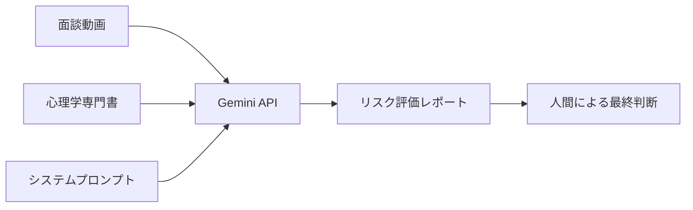

# プロジェクト詳細

## 実装案の実現可能性について（技術面）

### 結論
ご提案の「NotebookLMに読み込ませて、Geminiに参照させる」という構成は、そのままの形ではシステム的な実現が困難ですが、**「GeminiのAPI（Vertex AIまたはGoogle AI Studio）」を用いることで、狙い通りの機能を実現することは十分に可能**です。

### 根拠と技術的な制約

#### NotebookLMの仕様
- NotebookLMはそれ自体が「ユーザーがドキュメントを読み込ませて対話する」ための完成されたアプリケーション（UI）
- 現状、外部のGemini（Web版や自社システム）からAPI等のプログラム経由でNotebookLM内のデータを直接参照・抽出する機能は提供されていない

#### Geminiの動画解析能力
- Geminiモデル（Gemini 1.5 Proなど）は、長時間の動画データと大量のテキストデータを同時に処理する強力なマルチモーダル機能を持つ
- 1秒あたり約263トークンで動画を処理可能

## 現実的なシステム実装案

NotebookLMを間に挟むのではなく、**直接Geminiモデル（API）に「動画」と「専門書（ナレッジ）」を投入する構成**がベストプラクティスです。

### 実装ステップ

#### 1. ナレッジの準備
- 心理学・行動心理学の書籍や独自のマニュアルをテキスト化・PDF化する

#### 2. システムの構築
Google AI Studio または Google Cloud Vertex AI を使用し、以下のようなシステムプロンプトを設定:

```
あなたは行動心理学の専門家です。
以下のナレッジベース（書籍データ）を基準として、
動画内の人物の行動リスクを評価してください。
```

#### 3. 解析の実行
- 面談動画と、前述のテキストデータを同時にGemini APIに送信
- リスクスコアや特記事項を出力

## 具体的な処理フロー



### 処理の詳細

1. **入力データの準備**
   - 動画: 30分の面談動画（MP4形式など）
   - テキスト: 心理学専門書（PDF/テキスト形式）
   - プロンプト: 評価基準とフォーマット指示

2. **API呼び出し**
   - Gemini 1.5 Pro APIに3つのデータを同時送信
   - マルチモーダル処理により統合解析

3. **出力生成**
   - リスクスコア（数値化）
   - 具体的な行動観察結果
   - 推奨される対応策
   - 特記事項

## 技術的な実現方法

### パターン1: Google Apps Script（簡易版）
- Googleドライブに動画とナレッジをアップロード
- GASで自動処理トリガー
- スプレッドシートに結果を出力

**メリット:**
- ノーコード/ローコードで実現可能
- 既存のGoogle Workspaceと統合しやすい
- 初期投資が少ない

**デメリット:**
- 処理速度の制限
- カスタマイズ性に制約

### パターン2: Vertex AI統合（本格版）
- 既存のGCP環境に統合
- Cloud Storageで動画管理
- Cloud Functionsで自動処理
- BigQueryでデータ蓄積・分析

**メリット:**
- スケーラビリティが高い
- 既存システムとの連携が容易
- セキュリティが強固

**デメリット:**
- 初期構築コストが高い
- 技術的な専門知識が必要

## 運用に向けた不足情報の確認

より具体的なシステム要件や導入プロセスをご提案するために、以下の点について確認が必要:

### 1. 対象となる動画のボリューム
- ✅ 月間50名、1回30分（確定）
- 動画ファイルのフォーマットは？（MP4、MOV等）
- 保存期間の要件は？

### 2. システム化の度合い
以下のどちらを想定？

**A. 手作業運用（非エンジニア向け）**
- 担当者が手作業で動画とファイルをAIツールにアップロード
- Google AI Studioなどのノーコードツールを活用

**B. 自動化運用（システム統合）**
- 採用システムに組み込んで自動解析
- 既存のGCP/Heroku環境と統合

### 3. 出力フォーマットの要件
- どのような形式でレポートを受け取りたいか？
  - PDFレポート
  - スプレッドシート
  - JSON（システム連携用）
  - その他

### 4. セキュリティ要件
- 動画データの保存場所（クラウド/オンプレ）
- アクセス権限の管理方法
- データ保持期間とポリシー

## 次のアクション

情報が揃い次第、以下を進めます:

1. **プロトタイプの作成**
   - 簡単なGoogle Apps Script (GAS) のコード
   - Googleドライブに動画を置くだけで評価レポートが出力される検証環境（PoC）

2. **社内決裁用のドキュメント作成**
   - システム全体の構成案
   - AIが出力するレポートの具体的なフォーマット案
   - 導入スケジュールとマイルストーン
